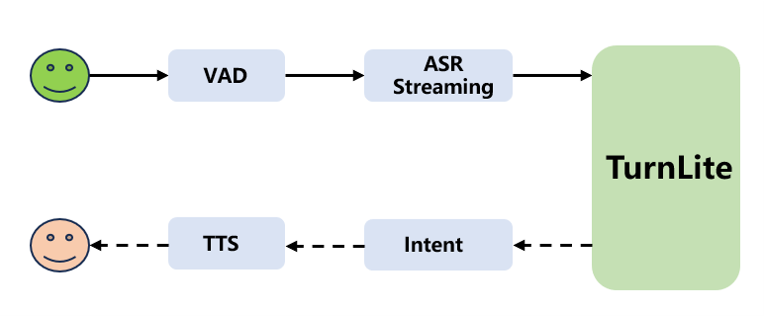
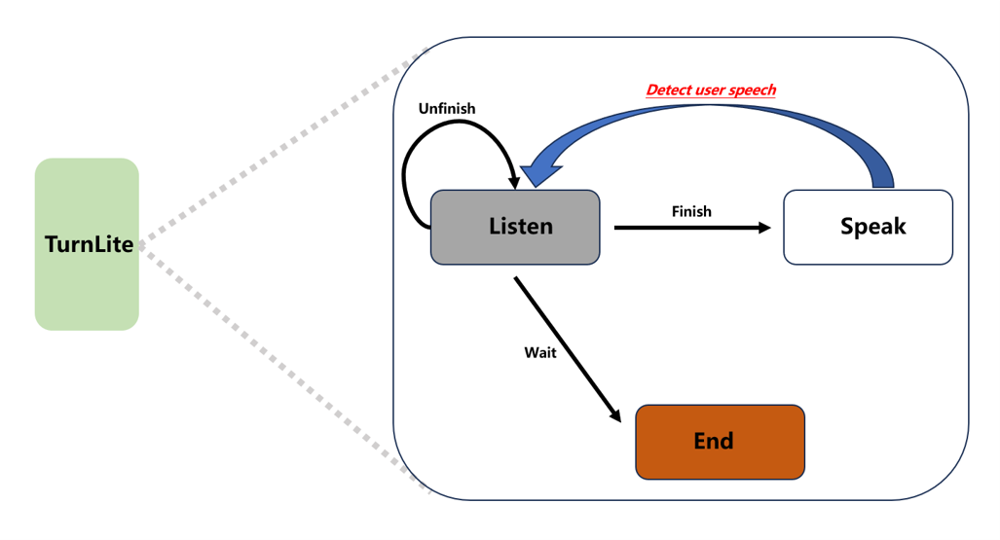

# TurnLite:  for Conversational Turn-Taking in Chinese Spoken Dialogue Systems

TurnLite 是一个专为会话轮次检测（Turn-taking Detection）设计的轻量级框架。它基于 Qwen 系列大语言模型，支持从原始数据处理、模型微调到自动化评估的全流程。

<p align="center">
  
  <br>
  <small><b>图 1：TurnLite 系统概览</b>。音频输入经由 VAD 和 ASR 流式处理后，由 TurnLite 进行状态分类，从而实时调节下游意图理解与 TTS 响应，实现客服对话中的实时打断检测。</small>
</p>

在系统的实时交互过程中，TurnLite 进一步利用 **神经有限状态机（NFSM）** 来建模上述决策过程（如下图所示）。TurnLite 预测的状态直接驱动 NFSM 的跳转，确保了全双工对话控制流的稳定性和鲁棒性。

<p align="center">
  
  <br>
  <small><b>图 2：Neural Finite State Machine (NFSM) 设计</b>。TurnLite 通过 NFSM 显式建模全双工对话行为：根据状态预测（<i>wait</i>, <i>finish</i>, <i>unfinish</i>）触发状态跳转。保持 <i>wait</i> 时 Agent 静默，跳转至 <i>finish</i> 时激活响应生成，而 <i>unfinish</i> 则保持监听，确保了对话控制流的模块化集成。</small>
</p>


## 核心功能

*   **模型支持**：深度集成 Hugging Face `transformers`，针对 Qwen2.5 系列模型进行了优化。
*   **多阶段训练支持**：项目支持从预训练 (Pretrain)、指令微调 (Finetune) 到思维链微调 (CoT) 的多阶段训练模式。
*   **状态分类**：支持将说话人的状态分为三类：
    *   `finished`: 说话已完成
    *   `unfinished`: 说话未完成（处于句中或需继续）
    *   `wait`: 等待状态或停顿
*   **思维链支持 (CoT)**：支持推理型 Prompt，允许模型在给出结论前进行思考，提升复杂场景下的检测效果。
*   **自动化流水线**：
    *   `data_processor.py`: 自动处理原始 JSONL 格式，支持自定义字段映射。
    *   `train.py`: 集成 `Trainer` 的高效微调脚本，支持 TensorBoard 日志记录。
    *   `evaluate_model.py`: 自动化的评估工具，生成详细的分类报告和混淆矩阵。

## 基于规则引导的 Prompt 策略

为了精准识别会话状态，TurnLite 采用了结构化的 Prompt 引导策略。系统 Prompt 中内置了针对不同状态的判定准则：

### 🏁 Prompt for Finish (判定“已完成”)
*   **动宾完整**：主谓宾结构完整出现；忽略口语中的重复。
*   **疑问完整**：疑问词/结构完整，且以 “吗 / 呢 / 啊 / 吧” 等语气词结尾。
*   **结果导向**：明确表达了预期结果或询问最终结果。
*   **复合句完整**：只要句中包含一个完整的语义单元即可。
*   **确认回应**：包含明确的确认词，如 “对 / 好的 / 不是 / 知道了”。
*   **特殊处理**：敏感词替换不影响整体语义判断。

### ⏳ Prompt for Unfinish (判定“未完成”)
*   **动词悬空**：主谓动词缺少必要宾语。例：“我想咨询”、“能不能”。
*   **介词缺宾**：介词短语不完整。例：“关于这个产品的”。
*   **疑问中断**：疑问句缺少关键成分。例：“什么时候”、“哪里”。
*   **语义不完整**：句子在关键信息点突然中断。例：“利息”、“然后”。
*   **语境依赖**：完全依赖后续语境，当前无法独立理解。

### ⏹️ Prompt for Wait (判定“等待/拒绝”)
*   **明确拒绝**：直接表达不需要继续对话。例：“不需要”、“不用了”、“谢谢不用了”。
*   **延迟处理**：表达需要暂停或延后。例：“等一下”、“稍后再说”、“现在没时间”。
*   **重复敷衍**：快速重复的简单确认。例：“好好好”、“行行行”、“知道了知道了”。
*   **情绪拒绝**：带有负面情绪的终止信号。例：“烦死了”、“闭嘴”、“别再打电话了”。
*   **礼貌结束**：常规的对话收尾。例：“再见”、“拜拜”、“我先挂了”。

## 快速开始

### 环境依赖

*   Python 3.8+
*   PyTorch 2.0+
*   Transformers, Datasets, PEFT
*   TensorBoard
*   Scikit-learn, Pandas, Matplotlib, Seaborn (评估相关)

### 目录结构

```text
TurnLite/
├── configs/           # 训练与评估的配置文件 (JSON)
├── data/              # 存放原始数据及处理后数据
├── data_processor.py  # 数据转换与 Tokenizer 处理
├── train.py           # 模型微调主脚本
├── evaluate_model.py  # 模型评估与指标生成脚本
└── README.md          # 项目说明
```

## 使用指南

### 1. 数据准备

原始数据推荐使用 JSONL 格式。你可以在配置文件中指定 `data_fields` 来映射字段：

```json
{"question": "今天的天气真的很", "answer": "unfinished"}
{"question": "请帮我预定下午的会议。", "answer": "finished"}
```

### 2. 模型训练

使用配置文件启动训练：

```bash
python train.py --config configs/train/your_train_config.json
```

关键配置项：
*   `model_path`: 预训练模型路径
*   `train_raw_path`: 原始训练数据路径
*   `output_dir`: 输出目录（存放 checkpoint 和 TensorBoard 日志）

### 3. 模型评估

对训练好的模型进行全面评估：

```bash
python evaluate_model.py --config configs/test/eval_config.json 
```

评估完成后，会在 `evaluation_results/` 目录下生成：
*   `evaluation_results.jsonl`: 详细的每条预测结果。
*   `classification_report.txt`: 标准分类指标（精确率、召回率、F1值）。
*   `confusion_matrix.png`: 混淆矩阵热图，直观展示分类效果。

## 实验结果

我们在开源测试集上对 TurnLite 的性能进行了评估。为了兼顾展示效率，下表中的数值格式为：**精确率 (Prec.) / 召回率 (Rec.)**。

### 1. Tenturn-Test 性能评估
在 Tenturn-Test 测试集上，数值格式为：**Precision (P) / Recall (R)**。

| System | Strategy | Finish (P/R) | Unfinish (P/R) | Wait (P/R) | Average (P/R) |
|:---|:---|:---|:---|:---|:---|
| model A | - | -/0.75 | -/0.89 | -/- | -/- |
| Tenturn | - | -/0.99 | -/0.93 | -/0.92 | -/0.95 |
| TurnLiteV1 | DPT | 0.80/0.93 | 0.90/0.82 | 0.92/0.73 | 0.88/0.83 |
| TurnLiteV2 | SFT | 0.91/0.98 | 0.99/0.87 | 0.88/0.93 | 0.93/0.93 |
| TurnLiteV3 | DPT+SFT | 0.93/0.99 | 0.99/0.92 | 0.95/0.96 | 0.96/0.96 |
| **TurnLiteV4** | **DPT+SFT+CoT** | **0.93/0.97** | **0.97/0.93** | **0.97/0.96** | **0.96/0.95** |

### 2. KeSpeech-Test 性能评估
在 KeSpeech-Test 测试集上，数值格式为：**Precision (P) / Recall (R)**。

| System | Strategy | Finish (P/R) | Unfinish (P/R) | Wait (P/R) | Average (P/R) |
|:---|:---|:---|:---|:---|:---|
| Tenturn | - | 0.87/0.89 | 0.89/0.87 | 1.00/0.99 | 0.92/0.92 |
| TurnLiteV1 | DPT | 0.82/0.81 | 0.82/0.85 | 1.00/0.97 | 0.88/0.88 |
| TurnLiteV2 | SFT | 0.91/0.98 | 0.99/0.87 | 1.00/0.98 | 0.95/0.95 |
| TurnLiteV3 | DPT+SFT | 0.96/0.95 | 0.94/0.96 | 1.00/0.99 | 0.97/0.97 |
| TurnLiteV4 | **DPT+SFT+CoT** | **0.94/0.96** | **0.92/0.96** | **1.00/0.97** | **0.96/0.96** |

### 3. aslp-test 性能评估
在 aslp-test 测试集上，数值格式为：**Precision (P) / Recall (R)**。

| System | Modality | Finish (P/R) | Unfinish (P/R) | Wait (P/R) | Average (P/R) |
|:---|:---|:---|:---|:---|:---|
| Paraformer + TEN | Linguistic | 0.87/- | 0.89/- | 0.91/- | 0.89/- |
| Smart Turn V2 | Linguistic | 0.79/- | 0.62/- | -/- | -/- |
| Finetuned Qwen2.5-0.5B-Instruct | Linguistic-only | -/- | -/- | -/- | 0.86/- |
| Finetuned Whisper + Linear | Acoustic-only | -/- | -/- | -/- | 0.85/- |
| Finetuned Qwen2.5-0.5B-Instruct | Linguistic-only | -/- | -/- | -/- | 0.86/- |
| Easy Turn | Acoustic+Linguistic | 0.96/- | 0.98/- | 0.98/- | 0.97/- |
| TurnLiteV3 | DPT+SFT | 0.95/0.82 | 0.86/0.96 | 0.88/0.95 | 0.90/0.91 |
| **TurnLiteV4** | **DPT+SFT+CoT** | **0.95/0.91** | **0.93/0.95** | **0.90/0.96** | **0.93/0.94** |


> **注**：
> * **DPT**: Domain Pre-training (领域预训练)
> * **SFT**: Supervised Fine-Tuning (监督微调)
> * **CoT**: Chain-of-Thought (思维链推理)

## 配置示例

在测试配置文件中，你可以灵活控制评估行为：

```json
{
    "experiment_name": "turnlite-qwen-cot",
    "system_prompt_file": "./data/prompt/system_prompt.txt",
    "data_fields": {
        "input": "question",
        "output": "answer"
    },
    "max_new_tokens": 128,
    "torch_dtype": "bfloat16",
    "gpu_ids": [0]
}
```

## 许可证

[MIT License](LICENSE)
